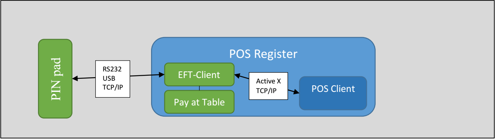

# Linkly.PayAtTable

The Pay at Table API provides a common interface for the PIN pad to utilise the EFT-Client to retrieve available tables and orders so payment functions (e.g. tender, customer receipt etc.) can be performed by an operator on the PIN pad without using the main POS UI. 

The Pay at Table client requires the POS to act a data source so that it can retrieve information about available tables, orders, payment options etc. 

The Pay at Table client supports two data source options for the POS; a REST server or directly through the existing Linkly interface. 

## Start Developing

To start developing the Linkly Pay at Table solution, following the instructions on the [Linkly API](http://linkly.com.au/apidoc/TCPIP/#pay-at-table).

## PC-EFTPOS Interface 
When in POS mode the Pay at Table extension will utilise the existing interface between the POS and EFT-Client (i.e. the interface used to perform a transaction using PC-EFTPOS).  

If the POS has implemented the PC-EFTPOS Active X interface the POS client must reside on the same PC as the EFT-Client. 

This project is an example of PC-EFTPOS interface example for ActiveX.

## Build and Test

1. Make sure you install the latest Linkly components described in [Start Developing](#start-developing).
2. Run Visual Studio 2017 and open the PayAtTable.TestPos solution.
3. Make sure PayAtTable.TestPos is the start-up project, run it. 
 
## Release Notes
v1.1.2.0
- Remove deprecated fields; add more sample data;

v1.1.1.0
- Load tender options from settings file;